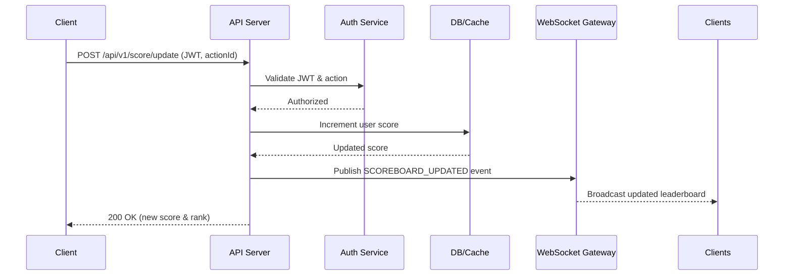

# Scoreboard Update Module Specification

## Overview

The **Scoreboard Update Module** provides secure and real-time score updates for users on our platform.  
It enables users’ scores to increase after completing authorized actions, and broadcasts live updates to all connected clients viewing the leaderboard.

---

## Table of Contents

1. [Architecture Overview](#architecture-overview)
2. [API Design](#api-design)
3. [Real-Time Update Mechanism](#real-time-update-mechanism)
4. [Data Model](#data-model)
5. [Security Considerations](#security-considerations)
6. [Performance & Scalability](#performance--scalability)
7. [Execution Flow Diagram](#execution-flow-diagram)
8. [Future Improvements](#future-improvements)

---

## Architecture Overview

The module is composed of five main components:

| Component | Description |
|------------|--------------|
| **API Layer** | Handles incoming HTTP requests to update scores. |
| **Auth Layer** | Validates the user’s identity and ensures the request is authorized. |
| **Business Logic Layer** | Applies the score increment logic and triggers leaderboard updates. |
| **Data Layer** | Persists user scores and retrieves the top users for display. |
| **Real-Time Layer** | Pushes updated leaderboard data to connected clients (via WebSocket or SSE). |

The system must ensure:
- Atomic score updates
- Secure verification of user actions
- Efficient real-time broadcasting to all connected clients

---

## API Design

### `POST /api/v1/score/update`

**Purpose:**  
Increase a user’s score after completing an authorized action.

#### Request
```http
POST /api/v1/score/update
Authorization: Bearer <JWT_TOKEN>
Content-Type: application/json

{
  "actionId": "abcd1234"
}
```

#### Response
```json
{
  "userId": "u123",
  "newScore": 5600,
  "rank": 3
}
```
#### Behavior
1. Validate the user via JWT.
2. Verify that the actionId represents a legitimate and non-replayed action.
3. Atomically increment the user’s score in the data store.
4. Publish a leaderboard update event to the real-time channel.
5. Return the user’s updated score and computed rank (not stored, derived from ordering).

#### Errors
|Code	|Meaning	|Example|
|---|---|---|
|400	|Invalid request	|Missing or malformed actionId|
|401	|Unauthorized	|Invalid or expired JWT|
|403	|Forbidden	|Unauthorized score update attempt|
|500	|Server error	|Database or cache failure|

#### Real-Time Update Mechanism
Clients receive live updates of the top 10 leaderboard through one of the following mechanisms:

##### Option 1: WebSocket (Preferred)
Persistent bidirectional connection.

Server emits a SCOREBOARD_UPDATED event to all subscribed clients.

```json
{
  "event": "SCOREBOARD_UPDATED",
  "data": {
    "leaderboard": [
      { "userId": "u1", "score": 5800 },
      { "userId": "u2", "score": 5750 }
    ]
  }
}
```

##### Option 2: Server-Sent Events (SSE)
Unidirectional connection (server → client).

Simpler implementation, suitable for read-only dashboards.

### Data Model
Table: `user_scores`
|Field	|Type	|Description|
|---|---|---|
|`user_id`	|UUID (PK)	|Unique identifier for each user|
|`score`	|INT	|User’s current total score|
|`updated_at`	|TIMESTAMP	|Last score update timestamp|

#### Indexes

- `score DESC` (for fast leaderboard queries)
- `user_id` (primary key)

#### Notes

- The rank is not stored — it is computed dynamically during query or broadcast.
- Caching (e.g., Redis Sorted Set) is recommended for top N queries:

```bash
ZREVRANGE leaderboard 0 9 WITHSCORES
```
## Security Considerations
### Authentication

- All API calls must include a valid JWT in the Authorization header.
- Tokens should contain `user_id` and `scope` claims.

### Authorization

- Users can only modify their own score.
- The server must validate the authenticity of the actionId.

### Action Validation

- Each action must have a unique signature or token.
- Prevent replay attacks by marking used actions as “consumed.”

### Rate Limiting

- Apply per-user rate limits on score updates.
- Block excessive or automated update attempts.

### Audit Logging

-Log all score changes for investigation and debugging.

## Performance & Scalability
|Concern	|Recommendation|
|---|---|
|Frequent score updates	|Use Redis as a cache layer for fast score increments. Sync periodically to the DB.|
|Leaderboard queries	|Cache top 10 users in Redis; recompute only on change.|
|Horizontal scaling	|Use a Pub/Sub (Redis, NATS, or Kafka) channel for broadcasting updates to multiple WebSocket instances.|
|Atomicity	|Use DB transactions or Redis atomic operations (ZINCRBY).|

## Execution Flow Diagram

## Future Improvements
- Dynamic Leaderboard Sizes – Support pagination or top-N queries beyond 10.
- Score Decay System – Allow scores to drop over time for competitive freshness.
- Async Queue for Heavy Load – Use a message queue to handle score updates at scale.
- Testing Strategy – Include a full suite of unit and integration tests.
- Observability – Integrate Prometheus/Grafana dashboards to monitor update rates and latency.