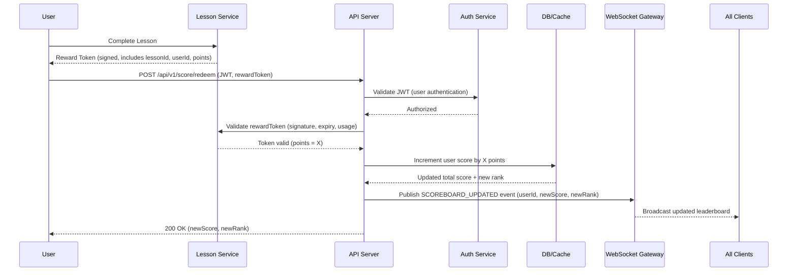

# Scoreboard Update Module Specification

## Original Software requirements

The **Scoreboard Update Module** provides secure and real-time score updates for users on our platform.  
It enables users’ scores to increase after completing authorized actions, and broadcasts live updates to all connected clients viewing the leaderboard.

1. We have a website with a score board, which shows the top 10 user’s scores.
2. We want live update of the score board.
3. User can do an action (which we do not need to care what the action is), completing this action will increase the user’s score.
4. Upon completion the action will dispatch an API call to the application server to update the score.
5. We want to prevent malicious users from increasing scores without authorisation.

| Let's say the action is completing a lesson on a course. An amount of points is awarded to the user for completing the lesson (just like Duolingo). And the leaderboard shows the top 10 users with the most points. Once user completes the Lesson service will reward him with a token that he can use to redeem points (where the Scoreboard Update Module will be come in to play). We use PostgreSQL as the database for the project at this moment, and the solution architect wants to use simple socket to broadcast the updates to all the connected clients.

| Since we already have the leaderboard, and it's ordered and takes only 10 users so I assume the database schema won't need to change. Even the rank column is not needed, we can calculate it on the fly.
---

## Table of Contents

1. [User stories](#user-stories)
2. [Execution Flow Diagram](#execution-flow-diagram)

---

## User stories

### Epic: Scoreboard Update Module
#### Description:
As a user of the learning platform, I want my score on the global leaderboard to automatically update in real-time when I complete a lesson, so that I can see my progress and compare it with others in an engaging and transparent way.

#### Business Value:
This module promotes user engagement, competitiveness, and retention by rewarding progress instantly while ensuring secure and authorized score updates.

### List of User Stories

| ID   | User Story | INVEST Principle | Priority | Story Points | Acceptance Criteria (AC) | Test Cases |
|------|------------|----------------|----------|--------------|-------------------------|------------|
| US1  | As a user, I want my score to increase securely when I redeem a reward token after completing a lesson, so that I get recognized for my achievements. | Independent, Valuable, Testable | High | 5 | 1. User submits reward token via `/api/v1/score/redeem`.  2. API validates JWT.  3. Reward token is validated (signature, expiry, usage).  4. User’s score in DB is incremented by the token points.  5. API responds with 200 OK and new total score. | 1. Submit valid reward token → expect 200 OK and correct new score.  2. Submit expired token → expect 400 error.  3. Submit token twice → expect 400 error (duplicate). |
| US2  | As a user, I want my updated score to appear on the leaderboard in real-time, so that I can see my ranking instantly. | Independent, Valuable, Small, Testable | High | 5 | 1. When user score changes, `SCOREBOARD_UPDATED` event is published.  2. All connected clients receive the updated leaderboard with new scores and ranks. | 1. Connect multiple clients → redeem token → all clients receive updated leaderboard.  2. Verify updated rank matches new score order. |
| US3  | As a system, I want to prevent unauthorized score updates, so that users cannot cheat or manipulate the leaderboard. | Independent, Valuable, Testable | High | 3 | 1. Only valid JWT and reward tokens are accepted.  2. Invalid or tampered tokens are rejected with 401/400.  3. Score is not incremented for invalid requests. | 1. Submit request without JWT → expect 401 Unauthorized.  2. Submit request with tampered token → expect 400 Bad Request.  3. Score remains unchanged after invalid submission. |
| US4  | As a system, I want to validate reward tokens for expiry and single-use, so that points cannot be redeemed multiple times. | Independent, Valuable, Small, Testable | Medium | 3 | 1. Reward token includes timestamp/expiry and usage status.  2. Token is rejected if expired or already redeemed.  3. Score is incremented only once per token. | 1. Submit expired token → expect 400 error.  2. Submit already redeemed token → expect 400 error.  3. Submit valid token → score incremented once. |
| US5  | As a system, I want to increment scores and calculate leaderboard ranks efficiently, so that the top 10 leaderboard is always accurate. | Independent, Valuable, Estimable, Testable | Medium | 5 | 1. DB increments user score atomically.  2. Leaderboard ranks recalculated after each update.  3. Top 10 users displayed correctly on leaderboard API. | 1. Increment multiple users → verify top 10 leaderboard order.  2. Check new rank after score increment matches expected order. |

## Execution Flow Diagram
